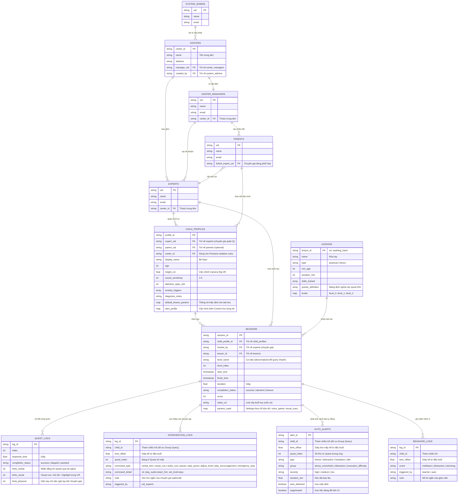
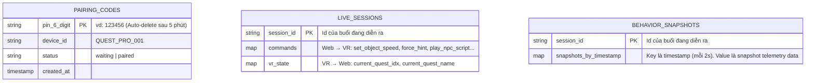

# 🗄️ Kiến trúc Database & Hệ thống dữ liệu

> **Công nghệ đề xuất: Hybrid Model (Kết hợp 2 loại Database)**
> 1. **Cloud Firestore:** Lưu trữ bền vững, query/filter phức tạp. Dùng cho Users, Profiles, Sessions, Lessons.
> 2. **Firebase Realtime Database:** Kênh truyền siêu tốc, độ trễ thấp cho dữ liệu tạm thời: PIN Pairing, Remote Commands.

> **Nguyên tắc thiết kế: Flat Structure with References** – Các collection đứng ngang hàng nhau ở cấp top-level, nối với nhau qua ID. Không lồng `sessions` vào `child_profiles` vì Chuyên gia cần query chéo nhiều trẻ cùng lúc mà không bị giới hạn bởi đường dẫn của một user cụ thể.

### 5.1 Quan hệ giữa các Collection (Firestore)

---

### 5.2 Firebase Realtime Database (Volatile – Tạm thời)

> Chỉ lưu dữ liệu "sống" trong buổi học. Tự động xóa sau khi kết thúc.

---
