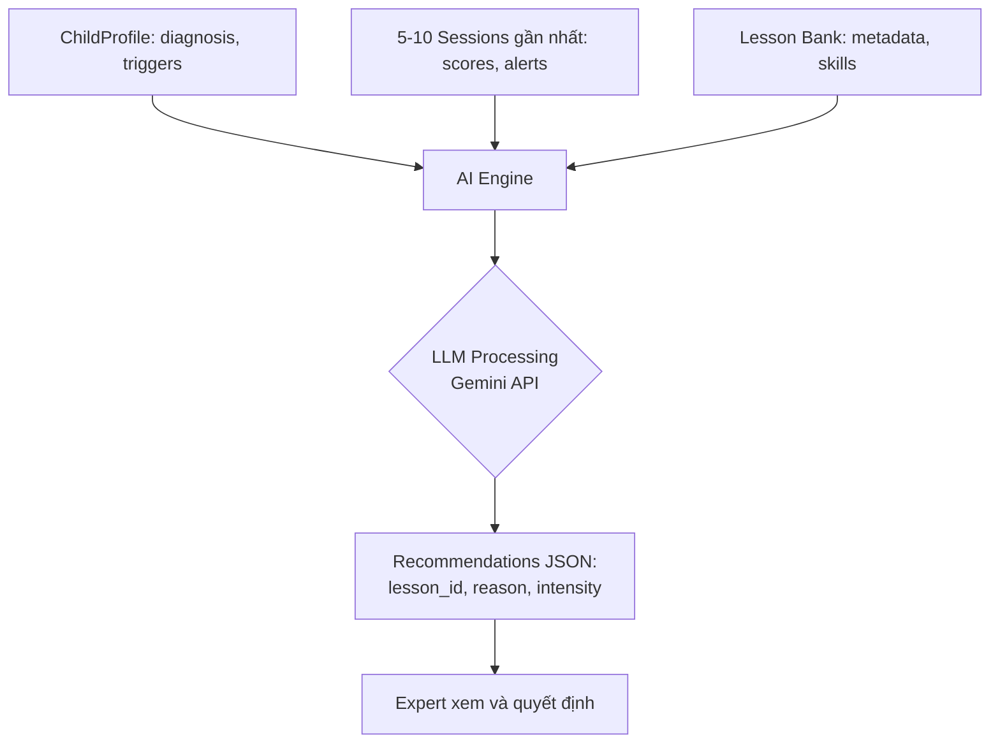
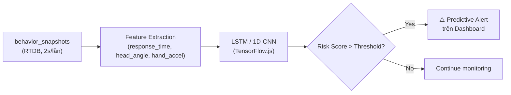
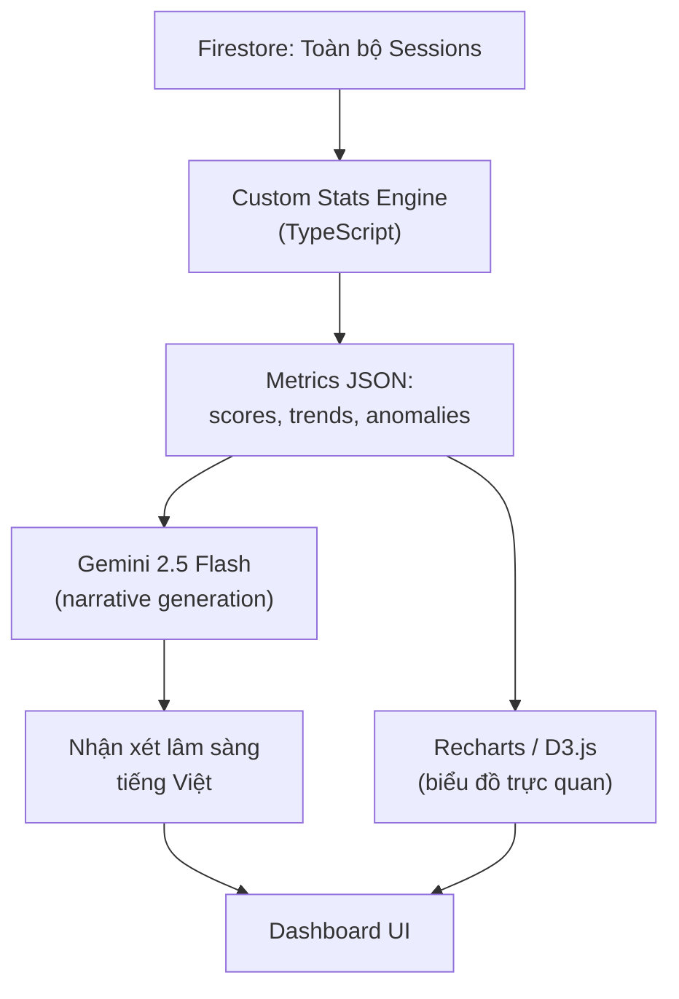
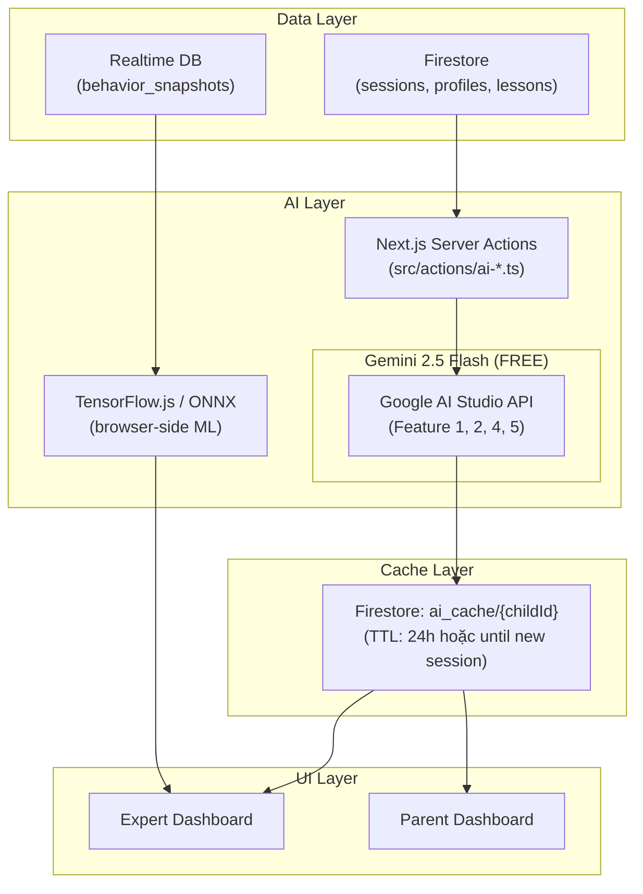

# 🧠 Đề Xuất Tích Hợp AI Cho Hệ Thống VRA-web

> **Mục đích:** Phân tích và đề xuất các tính năng AI phù hợp cho nền tảng VR Therapy dành cho trẻ tự kỷ (ASD), dựa trên kiến trúc hệ thống hiện tại và **có trích dẫn nghiên cứu khoa học uy tín**.
> **Ngày tạo:** 2026-05-20

---

## 📌 Nguyên Tắc Cốt Lõi

Tất cả tính năng AI đề xuất đều tuân thủ nguyên tắc **Human-in-the-Loop** đã được thiết lập trong [ARCHITECTURE.md](./architecture/ARCHITECTURE.md) — AI đóng vai trò **trợ lý đề xuất**, KHÔNG BAO GIỜ can thiệp trực tiếp lên môi trường VR của trẻ mà không qua sự phê duyệt của chuyên gia.

> [!IMPORTANT]
> Nguyên tắc Human-in-the-Loop được khẳng định bởi nhiều nghiên cứu: *"AI should be used as a supplement—not a replacement—for therapists. The most effective systems are those that enhance the capacity of human practitioners."* — Kohli et al., 2022; Failla et al., 2024.

---

## 🗂️ Tổng Quan 5 Tính Năng Đề Xuất

| # | Tính năng | Model đề xuất | Chi phí | Vai trò hưởng lợi | Ưu tiên |
|---|-----------|---------------|---------|-------------------|--------|
| 1 | **AI Lesson Recommender** | 🟢 Gemini 2.5 Flash | **FREE** | Expert | 🔴 Cao |
| 2 | **Auto Session Report** | 🟢 Gemini 2.5 Flash | **FREE** | Expert, Parent | 🔴 Cao |
| 3 | **Predictive Behavior Alert** | 🔵 Custom ML (Isolation Forest + LSTM) | **FREE** | Expert | 🟡 Trung bình |
| 4 | **Child Development Profile** | 🟣 Hybrid (Custom Stats + Gemini 2.5 Flash) | **FREE** | Expert, Center Manager | 🟡 Trung bình |
| 5 | **Parent AI Insight** | 🟢 Gemini 2.5 Flash | **FREE** | Parent | 🟢 Thấp |

> [!TIP]
> **Toàn bộ 5 tính năng đều MIỄN PHÍ.** Gemini 2.5 Flash có free tier trên Google AI Studio (không cần thẻ tín dụng): ~15 RPM, ~1,500 RPD, 1M TPM. Custom ML chạy local trên browser.

---

## 1. 🎯 AI Lesson Recommender — Gợi ý Bài Học Cá Nhân Hóa

### Mô tả
Hệ thống AI phân tích hồ sơ trẻ (`ChildProfile`), lịch sử buổi học gần nhất (`Sessions`), các cảnh báo thường xuyên (`Auto_Alerts`), và nhật ký hành vi (`Behavior_Logs`) để **đề xuất 3-5 bài học tối ưu** từ kho `Lessons` hiện có, kèm theo lý do chuyên môn.

### Dữ liệu đầu vào (Mapping hệ thống hiện tại)

| Dữ liệu | Collection Firestore | Trường quan trọng |
|----------|---------------------|-------------------|
| Hồ sơ trẻ | `child_profiles` | `condition`, `sound_sensitivity`, `attention_span_min`, `anxiety_triggers`, `diagnosis_notes` |
| Lịch sử học | `sessions` | `score`, `completion_status`, `duration`, `quest_logs` |
| Cảnh báo | `auto_alerts` (embedded in sessions) | `type` (freeze/distraction/hesitation), `severity`, `duration_sec` |
| Kho bài học | `lessons` (từ `lessons_extracted.json`) | `lesson_id`, `type` (practical/theoretical), `level_name`, `level_index` |

### Cách hoạt động



### Ví dụ Output
> *"Dựa trên 5 buổi gần nhất, bé Nam liên tục bị **freeze** (trung bình 3 lần/buổi) trong bài Grassland có âm thanh động vật. Khuyến nghị chuyển sang bài **Farm** ở level **Học lý thuyết** (không quiz) để giảm tải cảm giác, trước khi thử lại Grassland_Quiz."*

### 🤖 Model đề xuất: **Gemini 2.5 Flash**

| Tiêu chí | Chi tiết |
|----------|----------|
| **Model chính** | `gemini-2.5-flash` (Google AI) |
| **Lý do chọn** | Cần **suy luận lâm sàng** phức tạp: đọc hiểu hồ sơ trẻ, cross-reference với lịch sử 10 buổi, matching với lesson bank → Cần model có khả năng reasoning mạnh. Flash đủ mạnh cho task này mà chi phí hợp lý. |
| **Chi phí ước tính** | Input: ~$0.30/1M token, Output: ~$2.50/1M token |
| **Context window** | 1M tokens — dư sức chứa toàn bộ profile + 10 sessions + lesson bank |
| **Structured Output** | ✅ Hỗ trợ JSON Schema — trả về đúng format `{lesson_id, reason, intensity}` |
| **Model dự phòng** | `gemini-2.5-pro` nếu cần chất lượng reasoning cao hơn (ví dụ: trẻ có hồ sơ phức tạp) |

**Tại sao KHÔNG dùng GPT-4.1 Nano?** Task này đòi hỏi **multi-step reasoning** (so sánh hồ sơ ↔ lịch sử ↔ bài học), Nano quá nhẹ sẽ cho kết quả nông.

### 📚 Cơ sở khoa học

> [!NOTE]
> **[R1]** Minissi, M.E., Maddalon, L., Parsons, T.D., et al. (2024). *"Adaptive VR intervention on social-cognitive skills in children with ASD: a feasibility study."* Nghiên cứu cho thấy hệ thống VR **thích ứng** (adaptive) — điều chỉnh độ khó giữa các buổi dựa trên hiệu suất trẻ — giúp tăng đáng kể khả năng Theory of Mind và **giảm nhu cầu gợi ý (hints) theo thời gian**.
> - 📖 DOI: [10.2196/57093](https://doi.org/10.2196/57093) | Nguồn: JMIR / PubMed

> [!NOTE]
> **[R2]** Kohli, M., et al. (2022). *"Personalized ABA treatment goals using collaborative filtering."* — Sử dụng **collaborative filtering** và **patient similarity model** để gợi ý mục tiêu trị liệu ABA, đạt **độ chính xác 81-84%** so với kế hoạch của bác sĩ lâm sàng.
> - 📖 DOI: Pubmed/Brain Informatics | Nguồn: NIH/PubMed

> [!NOTE]
> **[R3]** Bhatt, S., Jogy, S., Puri, A. (2024). *"Integration of Virtual Reality (VR) and Artificial Intelligence (AI) in Autism Therapy."* — Concept note khẳng định AI có thể sử dụng **thuật toán ML để cá nhân hóa trải nghiệm VR**, thích ứng tiến trình real-time và cung cấp insights dựa trên dữ liệu cho nhà trị liệu.
> - 📖 DOI: [10.30574/ijsra.2024.12.1.1006](https://doi.org/10.30574/ijsra.2024.12.1.1006) | Nguồn: IJSRA

---

## 2. 📝 Auto Session Report — Tóm Tắt Buổi Học Bằng AI

### Mô tả
Sau mỗi buổi VR, AI tự động biến hàng trăm dòng raw data (quest_logs, intervention_logs, behavior_logs, auto_alerts) thành **một đoạn văn tóm tắt lâm sàng** dễ đọc bằng ngôn ngữ tự nhiên. Chuyên gia chỉ cần đọc, chỉnh sửa nếu cần, và lưu vào hồ sơ.

### Dữ liệu đầu vào

| Dữ liệu | Trường | Mục đích |
|----------|--------|----------|
| `quest_logs` | `response_time`, `completion_status`, `hints_*` | Đánh giá tốc độ phản xạ, mức độ cần hỗ trợ |
| `intervention_logs` | `command_type`, `time_offset`, `note` | Ghi nhận các can thiệp của chuyên gia |
| `behavior_logs` | `event` (meltdown, stimming), `note` | Sự kiện hành vi đáng chú ý |
| `auto_alerts` | `type`, `severity`, `duration_sec` | Các cảnh báo tự động từ sensor |

### Ví dụ Output

> **📋 Tóm tắt buổi học — Bé Nam, 15/05/2026, Bài: Farm (Level 1)**
>
> Tổng thời gian: 12 phút 30 giây | Điểm: 75/100 | Trạng thái: Hoàn thành
>
> **Điểm tích cực:** Bé phản xạ nhanh hơn bình thường 1.2 giây ở Quest 2 (nhận diện con bò). Không xuất hiện stimming trong suốt 8 phút đầu.
>
> **Điểm cần lưu ý:** Xuất hiện 2 lần freeze (mỗi lần ~4s) khi NPC phát âm thanh tiếng chó sủa (Quest 4). Chuyên gia đã can thiệp bằng lệnh `trigger_hint` (gợi ý hình ảnh) và trẻ tiếp tục được.
>
> **So sánh với buổi trước:** Số lần cần gợi ý giảm từ 5 → 3. Thời gian freeze giảm 20%.
>
> **Khuyến nghị:** Tiếp tục bài Farm ở level hiện tại 1-2 buổi nữa trước khi chuyển sang Farm_Quiz.

### 🤖 Model đề xuất: **Gemini 2.5 Flash** (Google AI — FREE)

| Tiêu chí | Chi tiết |
|----------|----------|
| **Model chính** | `gemini-2.5-flash` (Google AI Studio) |
| **Lý do chọn** | Task này là **data-to-text generation** — biến dữ liệu có cấu trúc thành văn xuôi. Không cần reasoning cực sâu, chỉ cần **tóm tắt + so sánh số liệu**. Flash thừa sức cho task này. |
| **Chi phí** | 🆓 **MIỄN PHÍ** — sử dụng free tier Google AI Studio |
| **Free tier limits** | ~15 RPM, ~1,500 RPD, 1M TPM — dư sức cho hệ thống |
| **Structured Output** | ✅ Hỗ trợ JSON Schema — ép trả về format chuẩn rồi render trên UI |
| **Model dự phòng** | `gemini-2.5-pro` nếu cần output chất lượng cao hơn (nhưng cần trả phí) |

**Tại sao dùng cùng model với Feature 1?** Đúng — cả Feature 1 và 2 đều dùng Gemini 2.5 Flash. Lợi ích: chỉ cần **1 API key, 1 SDK** (`@google/generative-ai`), đơn giản hóa codebase. Sự khác biệt nằm ở **prompt** chứ không phải model.

### 📚 Cơ sở khoa học

> [!NOTE]
> **[R4]** Nghiên cứu về LLM cho Clinical Summarization (2024-2025). Nhiều nghiên cứu đăng trên *Frontiers in Psychology* và *JMIR* cho thấy LLM có thể **tóm tắt buổi trị liệu**, giảm tải hành chính cho bác sĩ, cho phép tập trung vào bệnh nhân. Các benchmark mới (Mental Health Counseling-Component-Guided Dialogue Summaries) đánh giá năng lực này ngày càng chính xác.
> - 📖 Nguồn: Frontiers in Psychology, JMIR (2024-2025)

> [!NOTE]
> **[R5]** Nghiên cứu đăng trên *Cell* (2025) sử dụng LLM để **"decode" quá trình tư duy lâm sàng** từ hàng nghìn báo cáo chẩn đoán ASD hiện có, giúp xác định các mẫu hành vi và dấu hiệu ngôn ngữ mà bác sĩ sử dụng, từ đó hỗ trợ viết báo cáo tự động chính xác hơn.
> - 📖 Nguồn: Cell (2025) / Mila Quebec Institute

> [!NOTE]
> **[R6]** Mô hình **ASD-iLLM** (2024, ACL Anthology) — Fine-tuned LLM trên dữ liệu đối thoại lâm sàng ASD, có thể mô phỏng phong cách can thiệp của bác sĩ theo nguyên tắc ABA.
> - 📖 Nguồn: ACL Anthology (2024)

---

## 3. ⚡ Predictive Behavior Alert — Dự Đoán Hành Vi Bất Thường

### Mô tả
Nâng cấp Alert Engine hiện tại từ **phản ứng (reactive)** sang **dự đoán (predictive)**. Thay vì chờ freeze/distraction xảy ra mới cảnh báo, AI phân tích pattern lịch sử của trẻ để **cảnh báo sớm trước khi sự cố xảy ra**.

### Cách hoạt động

| Giai đoạn | Hiện tại (Reactive) | Đề xuất (Predictive) |
|-----------|--------------------|-----------------------|
| **Trước buổi học** | ❌ Không có | ✅ AI phân tích 10 buổi gần nhất → Cảnh báo: *"Bé thường freeze ở Quest 3-4 của bài Farm. Nên chuẩn bị hint sẵn."* |
| **Trong buổi học** | Phát hiện freeze sau 3s | ✅ Phát hiện xu hướng chậm lại từ Quest 2 → Cảnh báo: *"Response time đang tăng. Có thể freeze trong 30 giây nữa."* |
| **Sau buổi học** | Log cảnh báo | ✅ Phân tích trend: *"Freeze xuất hiện nhiều hơn 40% so với tháng trước. Cần đánh giá lại sound_sensitivity."* |

### 🤖 Model đề xuất: **Custom ML Pipeline** (KHÔNG dùng LLM)

> [!IMPORTANT]
> Feature này **KHÔNG nên dùng LLM**. Dự đoán hành vi real-time cần **tốc độ <100ms** và xử lý time-series data — LLM quá chậm và quá đắt cho task này.

| Thành phần | Model/Thuật toán | Lý do |
|------------|-----------------|-------|
| **Pre-session Risk Score** | **Isolation Forest** (scikit-learn) | Phát hiện anomaly trong lịch sử: trẻ nào có pattern bất thường so với chính mình. Lightweight, không cần training data lớn. |
| **In-session Prediction** | **LSTM (Long Short-Term Memory)** hoặc **1D-CNN** | Nhận `behavior_snapshots` từ RTDB (2s/lần), dự đoán xu hướng freeze/distraction trong 30-60s tới dựa trên chuỗi thời gian response_time + head rotation. |
| **Post-session Trend** | **Linear Regression + Moving Average** | Đơn giản, hiệu quả cho phân tích trend dài hạn (tần suất alert/tháng). Không cần deep learning. |
| **Triển khai** | **ONNX Runtime** (chạy trên Next.js server) hoặc **TensorFlow.js** (chạy trên browser) | Cross-platform, nhẹ, không cần GPU. |



**Tại sao KHÔNG dùng LLM?**
- ❌ LLM latency: 1-3 giây → **quá chậm** cho real-time (cần <100ms)
- ❌ LLM cost: gọi mỗi 2 giây × 15 phút = 450 lần/buổi → **phá sản**
- ✅ LSTM/1D-CNN: inference <10ms, chạy offline trên browser, chi phí = $0

### 📚 Cơ sở khoa học

> [!NOTE]
> **[R7]** Nghiên cứu sử dụng **unsupervised ML (k-means clustering, Gaussian mixture)** để xác định các "profile hành vi" (behavioral clusters) của trẻ ASD. Bằng cách nhóm trẻ theo cluster, nhà trị liệu có thể **dự đoán phản ứng trị liệu** và ưu tiên can thiệp cho nhóm có rào cản lớn nhất.
> - 📖 Nguồn: JMIR (2024)

> [!NOTE]
> **[R8]** Nghiên cứu về **personalized deep learning networks** trong Human-Robot Interaction therapy — phân tích dữ liệu hành vi để **ước lượng mức độ engagement real-time**, cho phép hệ thống thích ứng để duy trì sự tập trung của trẻ.
> - 📖 Nguồn: ScienceDaily / IEEE (2024)

---

## 4. 📊 Child Development Profile — Hồ Sơ Phát Triển AI

### Mô tả
AI tổng hợp dữ liệu từ **toàn bộ lịch sử buổi học** (không chỉ 5-10 buổi gần nhất) để xây dựng **"Developmental Trajectory"** — một bản đồ phát triển kỹ năng theo thời gian của trẻ.

### Các Metric AI tổng hợp

```
📈 Developmental Trajectory (Ví dụ bé Nam, 6 tháng):
├── 🗣️ Giao tiếp xã hội: 35% → 58% (+23%)  ↑ Cải thiện đáng kể
├── 👁️ Chú ý (Attention): 20% → 45% (+25%)  ↑ Cải thiện mạnh
├── 🤚 Tự phục vụ (Self-care): 50% → 62% (+12%)  ↑ Cải thiện nhẹ
├── 😰 Kiểm soát cảm xúc: 40% → 38% (-2%)  ⚠️ Cần chú ý
└── 🧩 Nhận diện hình ảnh: 60% → 78% (+18%)  ↑ Cải thiện tốt
```

### Mapping vào dữ liệu

| Metric | Nguồn dữ liệu | Cách tính |
|--------|---------------|-----------|
| Giao tiếp xã hội | `sessions` bài Greet/Intro | Score trung bình + completion rate |
| Chú ý | `auto_alerts` type=distraction | Tần suất distraction/buổi (giảm = tốt) |
| Tự phục vụ | `sessions` bài WashingHand | Score + hints needed (giảm = tốt) |
| Kiểm soát cảm xúc | `behavior_logs` event=meltdown | Tần suất meltdown (giảm = tốt) |
| Nhận diện hình ảnh | `quest_logs` bài Farm/Ocean/Grassland | response_time + accuracy |

### 🤖 Model đề xuất: **Hybrid** (Custom Stats + Gemini 2.5 Flash)

Feature này có 2 phần rõ rệt cần 2 loại model khác nhau:

| Phần | Model | Lý do |
|------|-------|-------|
| **Tính toán metrics** (% scores, trends) | **Custom code** (TypeScript thuần) | Đây là **phép tính thống kê** (trung bình, moving average, tỷ lệ). Dùng LLM cho phép cộng trừ là lãng phí. Viết code tính trực tiếp từ Firestore data. |
| **Narrative generation** (viết nhận xét) | **Gemini 2.5 Flash** | Sau khi có con số, dùng LLM để **diễn giải kết quả** thành nhận xét lâm sàng: *"Kỹ năng chú ý cải thiện mạnh +25%, tuy nhiên kiểm soát cảm xúc giảm nhẹ..."* |
| **Phát hiện anomaly** (metric bất thường) | **Z-Score / IQR** (thống kê đơn giản) | Nếu metric nào đột ngột giảm >2 standard deviations → Flag "⚠️ Cần chú ý". Không cần ML phức tạp. |



**Chi phí ước tính:** Chỉ gọi LLM 1 lần/tuần khi tạo báo cáo tổng hợp → ~$0.001/trẻ/tuần.

### 📚 Cơ sở khoa học

> [!NOTE]
> **[R9]** Belmaqrout, A., et al. (2025). *"Personalized virtual reality therapy for children with autism spectrum disorder."* — Nghiên cứu đề xuất PVRT (Personalized VR Therapy) **tùy chỉnh kích thích thị giác và thính giác** theo độ nhạy cảm cảm giác riêng của từng trẻ, giúp giảm quá tải cảm giác, kiểm soát lo âu và thúc đẩy điều hòa cảm xúc.
> - 📖 DOI: [10.11591/ijai.v14.i4.pp3444-3451](http://doi.org/10.11591/ijai.v14.i4.pp3444-3451) | Nguồn: IJ-AI (2025)

> [!NOTE]
> **[R10]** Cognitive Diagnosis Model (CDM) — Nghiên cứu đăng trên *Frontiers in Psychology* (2026) sử dụng mô hình GDINA để **phát hiện cơ chế cụ thể** gây ra triệu chứng tự kỷ (cảm giác, ngôn ngữ, xã hội) ở từng trẻ, từ đó xây dựng "quỹ đạo phát triển" (developmental trajectory) và gợi ý lộ trình phục hồi cá nhân hóa.
> - 📖 Nguồn: Frontiers in Psychology (2026) / PubMed

---

## 5. 👨‍👩‍👧 Parent AI Insight — Báo Cáo Dễ Hiểu Cho Phụ Huynh

### Mô tả
AI tạo **báo cáo đơn giản hóa** từ dữ liệu lâm sàng phức tạp, viết bằng ngôn ngữ phụ huynh có thể hiểu (không dùng thuật ngữ chuyên môn). Hiển thị trên dashboard `/dashboard/parent`.

### Ví dụ Output

> **🏠 Báo cáo tiến trình — Con bạn: Bé Nam**
> **Tuần 12-18/05/2026 (3 buổi học)**
>
> ✅ **Tin vui:** Con đã quen hơn với bài học về động vật nông trại. Số lần cần giáo viên nhắc nhở giảm đi nhiều so với tuần trước!
>
> 💡 **Cần quan tâm:** Con vẫn hơi sợ tiếng động to trong bài học. Giáo viên đã điều chỉnh âm lượng thấp hơn để con thoải mái hơn.
>
> 🎯 **Tuần tới:** Giáo viên dự kiến cho con thử bài quiz nhẹ về nông trại để kiểm tra kiến thức.

### 🤖 Model đề xuất: **Gemini 2.5 Flash** (Google AI — FREE)

| Tiêu chí | Chi tiết |
|----------|----------|
| **Model chính** | `gemini-2.5-flash` (Google AI Studio) |
| **Lý do chọn** | Task đơn giản nhất: **rewrite** báo cáo lâm sàng (từ Feature 2/4) thành ngôn ngữ phụ huynh. Chỉ cần khả năng **paraphrase + simplify**, Flash thừa sức. |
| **Chi phí** | 🆓 **MIỄN PHÍ** — cùng free tier với Feature 1, 2, 4 |
| **Tần suất gọi** | 1 lần/tuần/trẻ — rất thấp, không lo vượt quota |

**Tối ưu hóa:**
- Input cho Feature 5 chính là **output của Feature 2** (Auto Session Report). Không cần đọc raw data lại.
- Dùng **prompt template cố định** + inject summary → Output luôn nhất quán format.
- Dùng chung API key với Feature 1, 2, 4 → chỉ cần quản lý **1 key duy nhất**.

### 📚 Cơ sở khoa học

> [!NOTE]
> **[R11]** Failla, C., et al. (2024). *"Virtual reality for autism: unlocking learning and growth."* — Bài tổng quan hệ thống trên *Frontiers in Psychology* nhấn mạnh VR+AI tạo ra **môi trường "an toàn để thất bại" (safe-to-fail)**, cho phép trẻ luyện tập kỹ năng sống quan trọng. Bài báo cũng nhấn mạnh tầm quan trọng của việc **truyền tải insights dữ liệu đến cả phụ huynh** để tăng cường sự tham gia trong quá trình trị liệu.
> - 📖 DOI: [10.3389/fpsyg.2024.1417717](https://doi.org/10.3389/fpsyg.2024.1417717) | Nguồn: Frontiers in Psychology (2024)

---

## 🛠️ Đề Xuất Công Nghệ Triển Khai

### Bảng Tổng Hợp Model Theo Tính Năng

| Feature | Model | Loại | Chi phí | Gọi bao lâu? |
|---------|-------|------|---------|---------------|
| 1. Lesson Recommender | **Gemini 2.5 Flash** | LLM (Google) | 🆓 FREE | Khi có session mới |
| 2. Session Report | **Gemini 2.5 Flash** | LLM (Google) | 🆓 FREE | Sau mỗi buổi |
| 3. Predictive Alert | **Isolation Forest + LSTM** | Custom ML | 🆓 FREE (local) | Real-time (2s/lần) |
| 4. Development Profile | **Custom Stats + Gemini 2.5 Flash** | Hybrid | 🆓 FREE | 1 lần/tuần |
| 5. Parent Insight | **Gemini 2.5 Flash** | LLM (Google) | 🆓 FREE | 1 lần/tuần |

### Ước Tính Quota Sử Dụng (50 trẻ, 4 buổi/tuần)

| Feature | Số lần gọi/tháng | Token ước tính/lần | Dưới free tier? |
|---------|------------------|--------------------|------------------|
| 1. Lesson Recommender | 200 (50 trẻ × 4 tuần) | ~2,000 tokens | ✅ Dư sức |
| 2. Session Report | 800 (50 trẻ × 4 buổi × 4 tuần) | ~800 tokens | ✅ Dư sức |
| 3. Predictive Alert | ∞ (real-time) | N/A | ✅ Local, không gọi API |
| 4. Development Profile | 200 (50 trẻ × 4 tuần) | ~1,500 tokens | ✅ Dư sức |
| 5. Parent Insight | 200 (50 trẻ × 4 tuần) | ~400 tokens | ✅ Dư sức |
| | **TỔNG LLM calls:** | **~1,400/tháng** (~47/ngày) | ✅ Free tier cho ~1,500 RPD |

> [!TIP]
> **Tổng chi phí: $0/tháng.** Gemini 2.5 Flash free tier cho phép ~1,500 requests/ngày. Hệ thống chỉ cần ~47 requests/ngày (50 trẻ) → chỉ dùng **~3% quota free**. Ngay cả scale lên 500 trẻ vẫn còn trong free tier.

### Free Tier Limits (Google AI Studio)

| Giới hạn | Quota miễn phí | Hệ thống cần (50 trẻ) | Còn dư |
|----------|---------------|----------------------|--------|
| **RPM** (Requests/phút) | ~15 | ~1 (trung bình) | ✅ 93% dư |
| **RPD** (Requests/ngày) | ~1,500 | ~47 | ✅ 97% dư |
| **TPM** (Tokens/phút) | 1,000,000 | ~2,000 (trung bình) | ✅ 99.8% dư |

> [!WARNING]
> **Lưu ý về Free Tier:** Dữ liệu gửi qua free tier **có thể được Google sử dụng để cải thiện sản phẩm**. Đối với dữ liệu lâm sàng nhạy cảm, cần **ẩn danh hóa (anonymize)** trước khi gửi — ví dụ thay tên trẻ bằng ID, loại bỏ thông tin định danh cá nhân.

### Kiến trúc tổng thể



### NPM Packages cần thêm

| Package | Mục đích | Feature | Chi phí |
|---------|----------|--------|---------|
| `@google/generative-ai` | Gemini API client (free tier) | 1, 2, 4, 5 | 🆓 FREE |
| `@tensorflow/tfjs` | ML model inference trên browser | 3 | 🆓 FREE |
| `onnxruntime-web` | (Thay thế TF.js nếu cần) ML inference | 3 | 🆓 FREE |

> Không cần package `openai`. Toàn bộ LLM calls đều qua Google AI Studio.

### Chiến lược tối ưu Free Tier

> [!IMPORTANT]
> **Free tier có giới hạn quota.** Áp dụng các biện pháp sau để không bao giờ vượt:

1. **Cache kết quả:** Lưu vào Firestore `ai_cache/{childId}`, chỉ gọi lại LLM khi có session mới.
2. **Rate limiting:** Giới hạn 1 lần refresh AI / trẻ / ngày.
3. **Debounce requests:** Nếu Expert bấm "Refresh" liên tục, chỉ gọi API sau 5s delay.
4. **Feature 3 không dùng API:** Custom ML chạy local trên browser, không tốn quota.
5. **Anonymize data:** Loại bỏ PII (tên, ngày sinh) trước khi gửi lên Gemini free tier.
6. **Fallback khi hết quota:** Hiển thị cached result + thông báo *"Đang dùng bản gợi ý gần nhất"*.

---

## 📋 Tổng Hợp Trích Dẫn Khoa Học

| Mã | Tác giả | Năm | Tiêu đề | Nguồn | DOI |
|----|---------|-----|---------|-------|-----|
| R1 | Minissi, M.E. et al. | 2024 | Adaptive VR intervention on social-cognitive skills in children with ASD | JMIR/PubMed | [10.2196/57093](https://doi.org/10.2196/57093) |
| R2 | Kohli, M. et al. | 2022 | Personalized ABA treatment goals using collaborative filtering | Brain Informatics/PubMed | — |
| R3 | Bhatt, S. et al. | 2024 | Integration of VR and AI in Autism Therapy | IJSRA | [10.30574/ijsra.2024.12.1.1006](https://doi.org/10.30574/ijsra.2024.12.1.1006) |
| R4-R6 | Nhiều tác giả | 2024-2025 | LLM for Clinical Summarization / ASD-iLLM | Frontiers, JMIR, ACL, Cell | — |
| R7 | — | 2024 | Unsupervised ML for behavioral clustering in ASD | JMIR | — |
| R8 | — | 2024 | Deep learning for engagement tracking in HRI therapy | ScienceDaily/IEEE | — |
| R9 | Belmaqrout, A. et al. | 2025 | Personalized VR Therapy for Children with ASD | IJ-AI | [10.11591/ijai.v14.i4.pp3444-3451](http://doi.org/10.11591/ijai.v14.i4.pp3444-3451) |
| R10 | — | 2026 | Cognitive Diagnosis Model (GDINA) for ASD rehabilitation | Frontiers in Psychology | — |
| R11 | Failla, C. et al. | 2024 | Virtual reality for autism: unlocking learning and growth | Frontiers in Psychology | [10.3389/fpsyg.2024.1417717](https://doi.org/10.3389/fpsyg.2024.1417717) |

---

## ❓ Câu Hỏi Cần Xác Nhận Trước Khi Triển Khai

1. **Ưu tiên tính năng nào trước?** Khuyến nghị bắt đầu với Feature 1 (AI Lesson Recommender) vì đã có [AI_RECOMMENDATION_PLAN.md](./architecture/AI_RECOMMENDATION_PLAN.md) sẵn và dữ liệu đầu vào đã rõ ràng.

2. **Ngôn ngữ AI response:** AI trả về bằng **tiếng Việt** hay **tiếng Anh** (rồi UI dịch)?

3. **Dữ liệu thực:** Hiện tại đã có dữ liệu sessions thật từ Unity VR gửi lên chưa, hay vẫn đang dùng mock data?

4. **Privacy concern:** Free tier Gemini có thể dùng data để cải thiện model. Bạn có OK với việc anonymize data trước khi gửi không?
