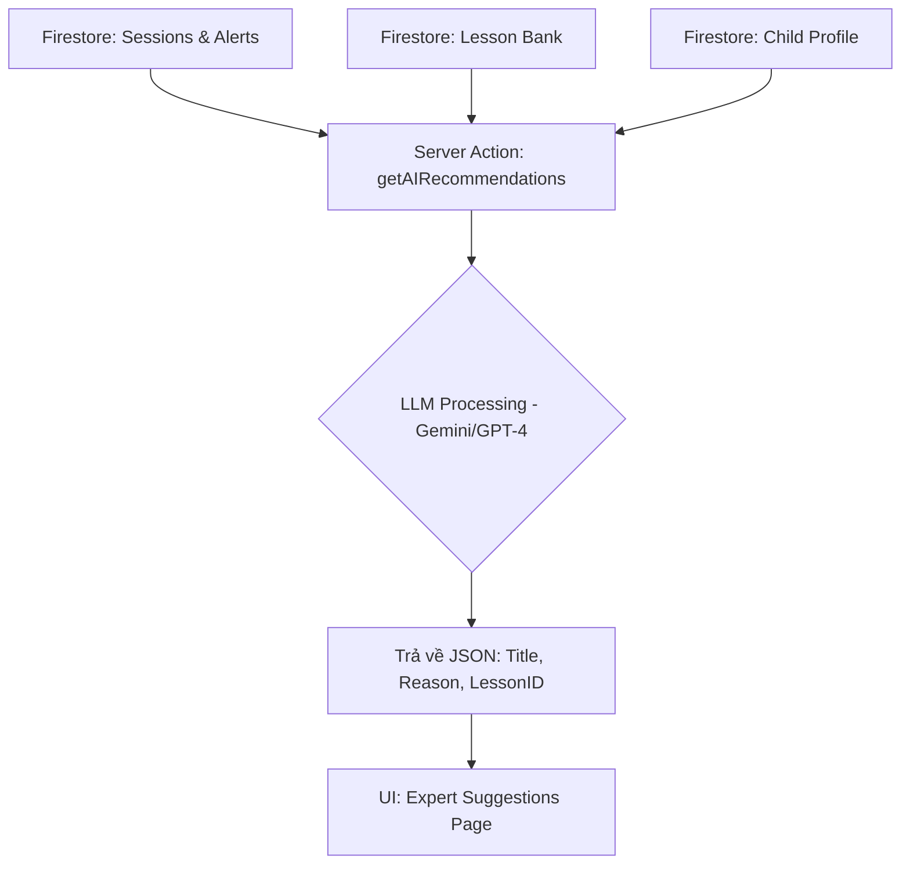

# Kế hoạch Hiện thực hóa tính năng Gợi ý Bài học AI (AI-Recommendations)

Tài liệu này phác thảo lộ trình nâng cấp trang `suggestions` từ dữ liệu mẫu (mock data) sang một hệ thống phân tích dữ liệu lâm sàng thực tế sử dụng trí tuệ nhân tạo (LLM).

## 1. Mục tiêu (Objective)
Chuyển đổi trang `/dashboard/expert/suggestions` trở thành một trợ lý thông minh cho chuyên gia bằng cách:
*   Tự động phân tích lịch sử tập luyện (Session history).
*   Nhận diện các dấu hiệu bất thường (Alerts) và xu hướng hành vi (Behavior logs).
*   Đề xuất các bài học phù hợp nhất từ kho dữ liệu Lesson có sẵn.

## 2. Luồng dữ liệu (Data Flow)



## 3. Các bước thực hiện chi tiết

### Giai đoạn 1: Chuẩn bị dữ liệu (Data Preparation)
*   **Hồ sơ trẻ:** Lấy thông tin về chẩn đoán (`condition`), điểm mạnh/yếu.
*   **Lịch sử gần nhất:** Lấy thông tin từ 5-10 buổi tập gần nhất (tổng điểm, các loại cảnh báo thường xuyên xuất hiện nhất).
*   **Danh sách bài học:** Xây dựng một bản liệt kê (Metadata) các bài học VR hiện có kèm theo mục tiêu của từng bài.

### Giai đoạn 2: Xây dựng AI Engine (Server-side)
*   Tạo một Server Action mới: `src/actions/ai-recommendations.ts`.
*   **Prompt Engineering:** Thiết kế câu lệnh cho AI theo cấu trúc:
    > "Dựa trên dữ liệu lâm sàng của trẻ A (có triệu chứng X, thường xuyên gặp lỗi Y), hãy chọn ra 3 bài học tối ưu nhất trong danh sách sau và giải thích lý do chuyên môn tại sao."
*   Sử dụng các thư viện như `openai` hoặc `google-generative-ai` để kết nối API.

### Giai đoạn 3: Cấu trúc lại UI (Frontend Update)
*   Thay thế `MOCK_SUGGESTIONS` bằng dữ liệu từ Server Action.
*   Thêm trạng thái **Loading Skeleton** (vì AI cần 2-3 giây để suy luận).
*   Thêm nút "Làm mới gợi ý" (Refresh) để AI tính toán lại dựa trên dữ liệu mới nhất.

## 4. Cấu trúc dữ liệu AI sẽ trả về (Schema)
Để tương thích với giao diện hiện tại, AI cần trả dữ liệu về dạng:
```json
{
  "recommendations": [
    {
      "id": "UUID",
      "title": "Tên mục tiêu can thiệp",
      "reason": "Lý do chuyên môn (Dựa trên dữ liệu thật)",
      "lessonTitle": "Tên bài học trong kho",
      "intensity": "Cao/Trung bình/Thấp",
      "duration": "15 phút",
      "benefits": ["Lợi ích 1", "Lợi ích 2"]
    }
  ]
}
```

## 5. Kế hoạch xác minh (Verification)
*   **Kiểm tra logic:** Nhập dữ liệu "Trẻ bị nhạy cảm âm thanh" -> Xem AI có gợi ý các bài về "Giảm mẫn cảm" không.
*   **Kiểm tra hiệu năng:** Đảm bảo thời gian phản hồi của AI không quá 5 giây.

---

> [!IMPORTANT]
> **Lưu ý về Chi phí:** Việc gọi API LLM sẽ phát sinh chi phí theo lượng token. Cần có cơ chế Cache (lưu tạm) kết quả gợi ý trong Firestore (ví dụ: gợi ý 1 lần dùng cho cả ngày) để tránh gọi API quá nhiều lần gây tốn kém.
