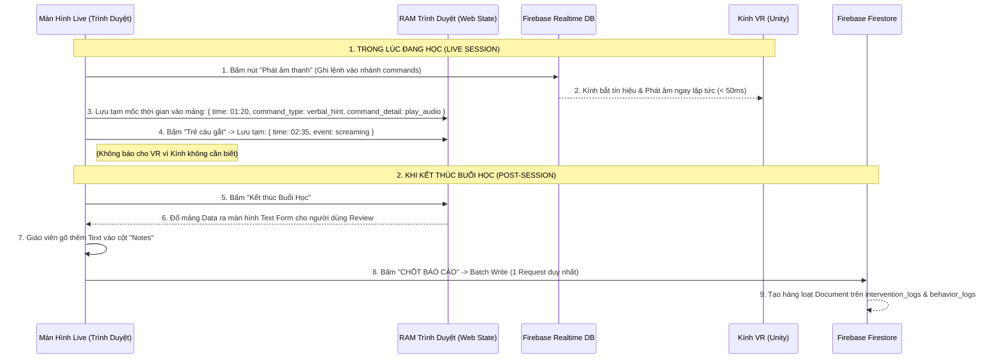

# Intervention & Behavior Logging System — Design Document

> **Trạng thái:** Bản nháp (Draft)  
> **Ngày cập nhật:** 2026-03-23  
> **Phạm vi áp dụng:** Web Dashboard (Màn hình Live Session & Post-Session)

---

## 1. Tổng quan (Overview)

Hệ thống **Manual Logging** cho phép Chuyên gia (Giáo viên) tương tác trực tiếp vào buổi học VR của trẻ và ghi chép lại các hành vi mang tính chủ quan. Hệ thống xoay quanh 2 hành động chính:

1. **Intervention (Can thiệp):** Thao tác chủ động gửi lệnh phản hồi từ Web vào Kính VR của trẻ (Vd: *"Giảm độ khó", "Phát âm thanh gợi ý"*). Kính VR sẽ thay đổi môi trường ngay lập tức, và hệ thống lưu lại log thao tác.
2. **Behavior Log (Ghi nhận hành vi):** Thao tác chốt lại các biểu hiện trạng thái tâm lý/hành vi của trẻ bằng mắt thường mà các thuật toán AI (Auto Alerts) không thể nhận biết được (Vd: *"Trẻ la hét", "Trẻ tự vỗ đầu"*).

---

## 2. Decision Log (Quyết định thiết kế)

| Quyết định | Nội dung | Lý do (Trade-offs) |
|---|---|---|
| **D1: UI Nút Bấm Nhanh (Quick Action Buttons)** | Trong lúc Live Session chỉ có Cụm nút Bấm (Không có ô gõ Text). Bấm 1 nút là lưu ngay `time_offset`. | Đảm bảo **tốc độ phản ứng** tức thời. Mắt chuyên gia không bị phân tâm khỏi màn hình POV của trẻ. |
| **D2: Post-Session Review (Ghi Notes sau buổi)** | Bước điền chi tiết chữ (cột `note`) bị trì hoãn (Deferred) cho đến màn hình Kết thúc buổi học (End-session). | Giảm tải nhận thức lúc Live. Đảm bảo độ sâu sắc của báo cáo y tế mà không làm hỏng tiến độ bài tập. |
| **D3: Cơ chế Chuyển đổi AI (AI Toggle Mode)** | Chuyên gia có quyền gạt công tắc `Auto-Pilot` ở góc màn hình để Tắt/Bật Hệ thống AI (Auto Alerts) theo từng buổi. | Nếu chuyên gia muốn tự kiểm soát 100%, tắt AI sẽ dọn dẹp giao diện, tránh nhiễu thông tin (noise). |

---

## 3. Chế độ Hoạt động: AI vs Manual (Smart Hybrid)

Dựa trên nguyên tắc không để mất dữ liệu và tránh trùng lặp biểu đồ, hệ thống chạy theo cơ chế:

*   **Trạng thái 1: BẬT AI (Auto-Pilot = ON)**
    *   `Auto Alerts` sẽ tự động quét và bắt các lỗi cơ bản vật lý (Freeze, Mất tập trung góc ngắm).
    *   Bảng nút bấm Manual Log (`Behavior`) sẽ bị ẩn bớt đi các nút trùng lặp (vd: Nút "Mất tập trung" sẽ bị khóa mờ đi vì AI đã lo việc đó).
    *   *Ưu điểm:* Giáo viên cực kỳ nhàn, chỉ việc đứng quan sát và can thiệp (Intervention).
*   **Trạng thái 2: TẮT AI (Auto-Pilot = OFF)**
    *   Bảng Sidebar `Auto Alerts` tự động ẩn/biến mất khỏi màn hình.
    *   Toàn bộ hệ thống nút bấm `Behavior Logs` khổng lồ hiện ra (Giáo viên tự bấm tay "Mất tập trung", "Đứng hình"...). Dữ liệu vẽ biểu đồ do con người quyết định 100%.

---

## 4. Phác thảo Giao diện (UI Layout)

### 4.1 Màn hình Live Session (Web Dashboard)

```text
┌─────────────────────────────────────────────────────────┐
│ [🔴 Chấm đỏ] Live Session   03:45       [ 🌊 AI: ON ]   │
├────────────────────────────────┬────────────────────────┤
│                                │ [ 🎮 BẢNG CAN THIỆP ]   │
│                                │ 🟢 Hạ độ khó (Easy)    │
│        VIDEO POV STREAM        │ 🔊 Phát âm vỗ tay      │
│      (Góc nhìn từ Kính VR)     │ 👁️ Bật mũi tên gợi ý   │
│                                │ ⏸️ Tạm dừng Scene       │
│                                │                        │
│                                │ ────────────────────── │
│                                │ [ 📝 GHI NHẬN HÀNH VI ] │
│                                │ 😠 Trẻ cáu gắt/La hét   │
│                                │ 🌀 Tự kỷ ám thị (Stim)  │
│                                │ ❌ Đập phá đồ vật       │
└────────────────────────────────┴────────────────────────┘
```
*(Lưu ý: Mọi nút bấm bên phải khi click sẽ lập tức sinh ra 1 bản ghi vào RAM của trình duyệt kèm mốc thời gian `time_offset` hiện tại).*

### 4.2 Màn hình Kết thúc (Post-Session Review)

Ngay sau khi bấm nút [Kết thúc Buổi học], một bảng Review toàn màn hình hiện ra trước khi Save vĩnh viễn vào DB:

```text
📊 BÁO CÁO NHANH BUỔI HỌC
Hãy rà soát lại các mốc thời gian và điền thêm ghi chú nếu cần:

| Thời gian | Loại thao tác | Chi tiết hành động    | Ghi chú bổ sung (Tùy chọn)        |
|-----------|---------------|-----------------------|-----------------------------------|
| 01:20     | Can thiệp     | Phát âm gợi ý         | [                              ]  |
| 02:35     | Hành vi       | Trẻ cáu gắt/La hét    | [ Do tiếng còi xe bên ngoài... ]  |
| 02:40     | Can thiệp     | Tạm dừng Scene (Pause)| [                              ]  |

[ HỦY / BỎ QUA ]                              [ LƯU VÀ XUẤT BÁO CÁO HOÀN CHỈNH ]
```

---

## 5. Schema Lưu trữ vào Firestore

Khi bấm nút **[ LƯU VÀ XUẤT BÁO CÁO ]**, toàn bộ mảng Review trên mới thực sự bắn 1 cục Batch-Write lên Firestore.

### Bảng `INTERVENTION_LOGS`
*   `log_id`: `uuid`
*   `child_id`: `profile_nam`
*   `time_offset`: `155.5` (giây)
*   `quest_index`: `0` (Số thứ tự Quest)
*   `command_type`: `verbal_hint` (Loại lệnh)
*   `command_detail`: `play_audio:step1_hint` (Đã bắn lệnh qua Realtime DB cho kính VR)
*   `note`: `" "` (Để trống nếu không ghi)
*   `triggered_by`: `uid_expert1`

### Bảng `BEHAVIOR_LOGS`
*   `log_id`: `uuid`
*   `child_id`: `profile_nam`
*   `time_offset`: `155.5` (giây)
*   `event`: `screaming` (La hét)
*   `note`: `"Do tiếng còi xe bên ngoài"`
*   `triggered_by`: `uid_expert1`

*(File này là thiết kế làm chuẩn cho code Frontend và cấu trúc Log)*

## 6. Luồng Lưu Dữ Liệu (Data Flow)

Để đảm bảo hiệu năng cao và độ trễ = 0 cho các luồng tương tác VR, luồng sự kiện sẽ đi như sau:



**So sánh với Auto Alerts:**
Luồng này **TUYỆT ĐỐI GIỐNG VÀ ĐỒNG NHẤT** với tư duy lưu trữ tính năng `AUTO_ALERTS` của bạn!
Mọi sự kiện phát sinh trong lúc Web hoạt động (dù do Cảm biến thuật toán AI chớp lỗi, hay do Giáo viên bằng mắt thường bấm nút ghi nhận) đều **Được gom vào 1 rổ (Buffer RAM)**. Nhờ đó tới cuối buổi học, giáo viên có thể rà soát lại tất cả các cột mốc cả bằng máy phát hiện và bằng mắt người trên cùng 1 bảng tổng sắp. Cuối cùng, tất cả sẽ "nắm tay nhau" cùng Batch-Write lên Firestore trong một lượt duy nhất!
