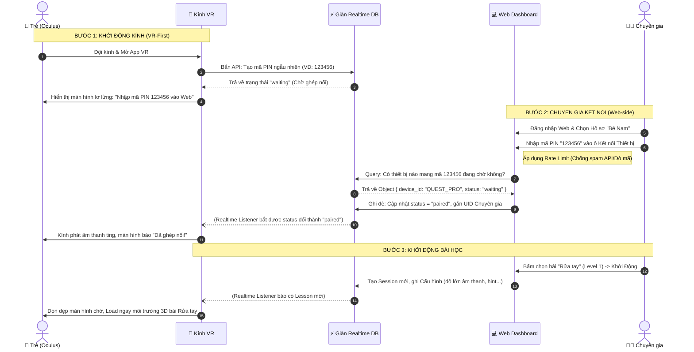
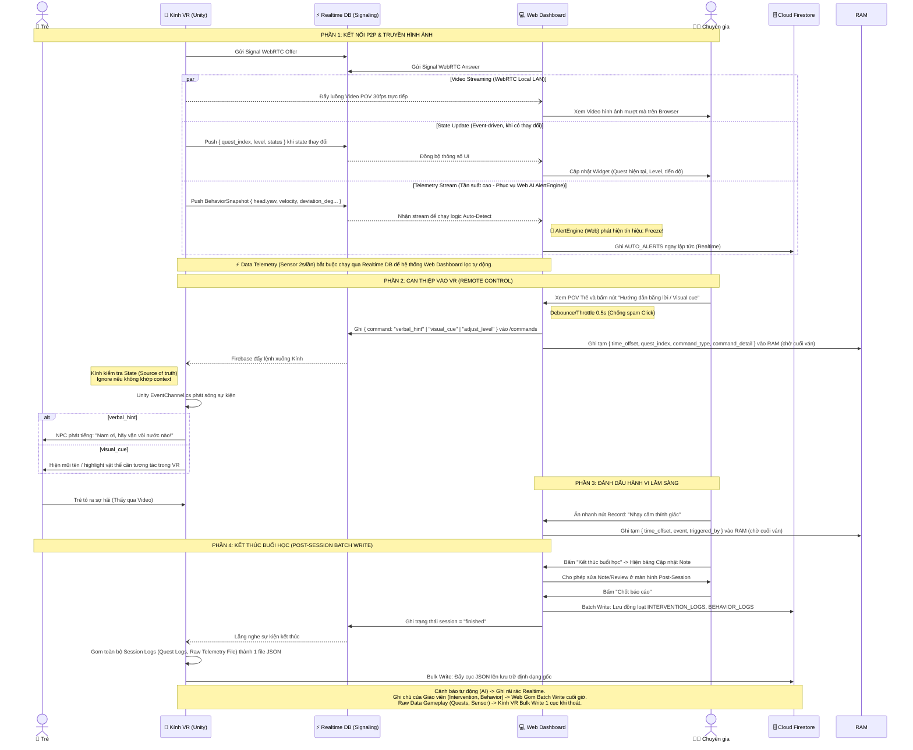
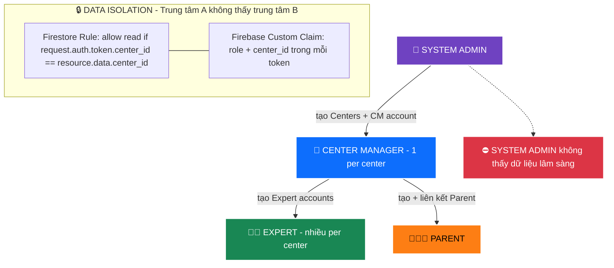

# 🖼️ HỆ THỐNG BIỂU ĐỒ KIẾN TRÚC & NGỮ CẢNH (SYSTEM DIAGRAMS)
Dự án: **VR-Autism** (Hệ sinh thái Giáo dục & Trị liệu cho Trẻ tự kỷ bằng VR)

> **Mục đích file này:** Tập hợp toàn bộ các bản vẽ phác thảo, biểu đồ thiết kế hệ thống quan trọng nhất. Phục vụ cho System Architect, BA và các Developer cái nhìn trực quan nhất về luồng chạy và phân chia khu vực của dự án.

---

## 2.3 Biểu đồ Luồng Dữ liệu Mức 1 (Data Flow Diagram - Level 1)

```mermaid
flowchart TD
    %% Styles cho DFD chuẩn
    classDef external fill:#f9f9f9,stroke:#333,stroke-width:2px,color:#000
    classDef process fill:#1e4c9e,stroke:#fff,stroke-width:2px,color:#fff,shape:circle
    classDef datastore fill:#1168bd,stroke:#fff,stroke-width:2px,color:#fff,shape:rect,stroke-dasharray: 5 5

    %% EXTERNAL ENTITIES
    E0A["\uD83D\uDD11 System Admin"]:::external
    E0B["\uD83C\uDFEB Quản lý Trung tâm"]:::external
    E1A["\uD83D\uDC68\u200D\uD83C\uDFEB Chuyên gia"]:::external
    E1B["\uD83D\uDC68\u200D\uD83D\uDC69\u200D\uD83D\uDC66 Phụ huynh"]:::external
    E2["\uD83D\uDC66 Trẻ tự kỷ"]:::external

    %% DATA STORES
    D0[(D0: Hệ thống Trung tâm)]:::datastore
    D1[(D1: Hồ sơ Trẻ)]:::datastore
    D2[(D2: Bài học)]:::datastore
    D3[(D3: Live DB)]:::datastore
    D4[(D4: Lịch sử & Logs)]:::datastore

    %% QUẦNG BÊN WEB DASHBOARD
    subgraph WEB [\uD83D\uDCBB Tuyến Web Dashboard]
        P0(("0.0\u003cbr/\u003eQuản lý\nTrung tâm")):::process
        P1(("1.0\u003cbr/\u003eQuản lý\nHồ sơ")):::process
        P2(("2.0\u003cbr/\u003eCấu hình\nBài học")):::process
        P5(("5.0\u003cbr/\u003ePhân tích\nBáo cáo")):::process
    end

    %% QUẦNG BÊN VR APP
    subgraph VR [🥽 Tuyến Ứng dụng VR]
        P4(("4.0<br/>Khởi chạy<br/>VR Game")):::process
    end

    %% QUẦNG CHUNG
    P3(("3.0<br/>Đồng bộ<br/>Real-time")):::process


    %% Từ Chuyên gia
    E1A -- "Tạo/Sửa Hồ sơ" --> P1
    E1A -- "Set Phác đồ" --> P2
    P5 -- "Báo cáo chuyên môn" --> E1A
    E1A -- "Lệnh Co-pilot Live" --> P3
    P3 -- "Ghi AUTO_ALERTS (Realtime) & Logs Manual (Batch)" --> D4
    
    %% Từ Phụ huynh
    E1B -- "Cập nhật Nhạy cảm" --> P1
    P5 -- "Tóm tắt kết quả" --> E1B
    E1B -- "Lệnh khởi động (PIN)" --> P3

    %% Tương tác Kho dữ liệu
    P1 -- "Lưu/Tải dữ liệu" --> D1
    D1 -- "Trích xuất hồ sơ" --> P1
    D2 -- "Đọc File Bài Học" --> P2
    P5 -- "Truy vấn Lịch sử" --> D4
    P5 -- "Truy vấn Thông tin" --> D1

    %% Luồng Cấu hình
    P2 -- "Gửi dữ liệu Session" --> P3
    P3 -- "Các tham số môi trường" --> P4
    
    %% Tương tác Kho Live
    P3 -- "Ghi nhận trạng thái" --> D3
    D3 -- "Đồng bộ realtime" --> P3
    
    %% Quá trình chơi VR
    P4 -- "Hình ảnh 3D, Âm thanh" --> E2
    E2 -- "Hành vi, Phản xạ" --> P4
    
    %% Ghi nhận Data
    P4 -- "Tọa độ sensor (Telemetry)" --> P3
    P3 -- "Cập nhật Tiến độ" --> E1A
    P3 -- "Cập nhật Tiến độ" --> E1B

    P4 -- "Ghi Session + Quest Logs (Bulk Write)" --> D4

```

---

## 2.4 Biểu đồ Tuần tự: Luồng Kết nối Thiết bị (Device Pairing Sequence)
> **Mục tiêu:** Trả lời cho lập trình viên biết quá trình "nhấn nút" và "load giao diện" giữa Kính VR và Web khi **chuyên gia** nhập mã PIN và khởi động buổi học diễn ra theo thứ tự API nào.



---

## 2.5 Biểu đồ Tuần tự: Luồng Co-located & Điều khiển (Live Control Sequence)
> **Mục tiêu:** Minh họa luồng dữ liệu liên tục trong suốt thời gian học tại cùng một địa điểm. Video POV được bắn thẳng từ kính VR sang Web Dashboard thông qua mạng LAN (Peer-to-Peer WebRTC) để Chuyên gia xem và điều khiển trên cùng 1 màn hình.



---

## 2.6 Phân cấp Vai trò & Phân quyền (Role Hierarchy)
> **Mục tiêu:** Mô tả rõ ai có quyền làm gì, dữ liệu nào họ được truy cập. Bảo mật được thực thi tại **Firestore Security Rules** (server-side) và **Firebase Custom Claims** (token-based), không phải chỉ ở frontend routing.



### Bảng quyền đầy đủ

| Quyền | System Admin | Center Manager | Expert | Parent |
|---|:---:|:---:|:---:|:---:|
| Tạo / xóa Centers | ✅ | ❌ | ❌ | ❌ |
| Tạo Center Manager | ✅ | ❌ | ❌ | ❌ |
| Tạo Expert accounts | ❌ | ✅ | ❌ | ❌ |
| Tạo Parent accounts | ❌ | ✅ | ❌ | ❌ |
| Quản lý Child Profiles | ❌ | ✅ trung tâm mình | ✅ của mình | ❌ |
| Chạy Sessions | ❌ | ❌ | ✅ | ❌ |
| Xem báo cáo lâm sàng | ❌ | ✅ tổng trung tâm | ✅ trẻ của mình | ✅ con mình |
| Tạo / sửa Lessons | ❌ | ❌ | ❌ | ❌ |
| Lessons do ai quản lý? | Dev / DB migration | ❌ | ❌ | ❌ |
