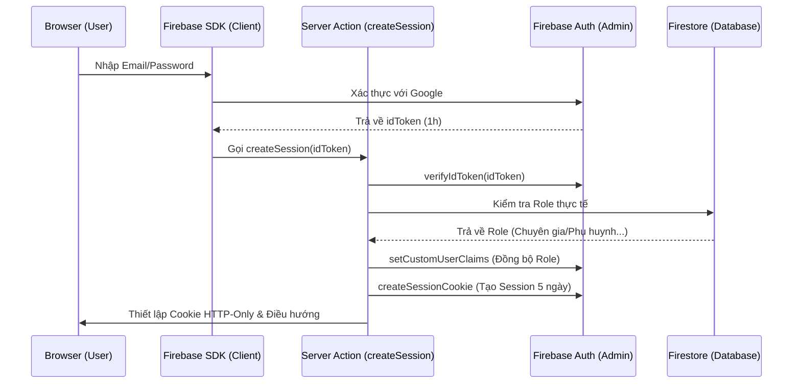

# 🏗️ Kiến Trúc Hệ Thống: Xác Thực & Liên Kết Dữ Liệu (VRA)

Tài liệu này cung cấp cái nhìn toàn diện về cách VRA vận hành, từ lúc người dùng đăng nhập cho đến khi dữ liệu được liên kết, trao đổi và bảo vệ an toàn giữa các vai trò (Role).

---

## 1. Cơ Chế Xác Thực & Phân Quyền (RBAC)

Đây là "cánh cổng" đầu tiên và quan trọng nhất của hệ thống, sử dụng công nghệ JWT (JSON Web Token) tiên tiến.

### 🔑 Quy trình Đăng nhập Chi tiết (Auth Flow)

VRA không chỉ sử dụng Firebase Auth đơn thuần mà còn xây dựng một lớp xác thực kết hợp giữa Token và Database để đảm bảo an toàn tối đa:

1.  **Firebase Auth Client:** Người dùng nhập Email/Password, SDK sẽ xác thực với Google và trả về `idToken` (ngắn hạn - 1h).
2.  **Verify Token (Server):** Token này gửi lên Server thông qua `createSession`. Server dùng **Firebase Admin SDK** để xác minh tính chính danh.
3.  **Role Identification:** Hệ thống kiểm tra Custom Claims trong Token và đối soát với quy tắc Admin (hardcoded email).
4.  **Firestore Sync (Source of Truth):** Server kiểm tra vai trò thực tế trong Database (`experts`, `parents`, `center_managers`) để đảm bảo quyền hạn luôn được cập nhật mới nhất.
5.  **Set Custom Claims:** Nếu có sự khác biệt về vai trò giữa Token và Database, Server sẽ cập nhật lại Custom Claims để các Token sau này luôn chính xác.
6.  **Session Cookie (HTTP-Only):** Thay vì dùng ID Token ở Client, Server tạo một **Session Cookie** có thời hạn **5 ngày**. Cookie này được đánh dấu `httpOnly` (chống XSS) và `secure` (chỉ gửi qua HTTPS).
7.  **Middleware Routing:** Trong các yêu cầu sau, Middleware sẽ giải mã Cookie này để điều hướng người dùng về đúng Dashboard theo vai trò của họ.

### 🛡️ Lớp chặn Middleware (Edge Verification)
Sử dụng **Next.js Middleware** kết hợp thư viện `jose` để kiểm soát truy cập tại tầng Edge (tốc độ cao):
- **Kiểm tra Cookie:** Middleware đọc `session` cookie từ các Request gửi lên.
- **Xác thực chữ ký số:** Tự động fetch Public Keys từ Google để đảm bảo Cookie không bị giả mạo.
- **Cách biệt phân vùng (Route Protection):**
    - Quản trị viên -> `/dashboard/admin/**`
    - Trung tâm -> `/dashboard/center/**`
    - Chuyên gia -> `/dashboard/expert/**`
    - Phụ huynh -> `/dashboard/parent/**`
- **Điều hướng thông minh:** Tự động "đẩy" người dùng về đúng phân vùng dashboard của họ dựa trên Role có trong Session.

---

## 2. Kiến Trúc Dữ Liệu (Firestore Schema)

Hệ thống sử dụng mô hình **NoSQL** tập trung vào hiệu năng truy vấn thông qua các ID tham chiếu.

### 📦 Các Collection chính:

| Thực thể | Key (ID) | Vai trò liên kết |
| :--- | :--- | :--- |
| **Centers** | `docId` | Gốc rễ, chứa `expertCount`, `totalChildren`. |
| **Experts** | `uid` | Chuyên gia thuộc một `centerId`. |
| **Parents** | `uid` | Phụ huynh thuộc một `centerId`. |
| **Child Profiles** | `docId` | Trung tâm kết nối: chứa `centerId`, `expertUid`, `parentUid`. |
| **Messages** | `docId` | Chứa nội dung trao đổi, `roomId`, `participants`, `childId`. |

---

## 3. Cơ Chế Liên Kết & Nghiệp Vụ (The Linkage)

Đây là cách hệ thống kết nối con người với dữ liệu thực tế thông qua **Linkage UI** tại Dashboard Trung tâm.

### 🧑‍⚕️ Chuyên gia <-> Trẻ (Quan hệ 1 - N)
- Một trẻ chỉ có duy nhất một chuyên gia phụ trách tại một thời điểm.
- **Liên kết thủ công:** Center Manager thực hiện gán Chuyên gia vào hồ sơ Trẻ thông qua giao diện quản lý. Hệ thống sẽ cập nhật trường `expertUid` trong tài liệu hồ sơ trẻ.
- **Truy vấn:** `.where("expertUid", "==", expertUid)` giúp chuyên gia chỉ thấy trẻ mình phụ trách.

### 👨‍👩‍👧 Phụ huynh <-> Trẻ (Quan hệ 1 - N)
- Manager thực hiện gắn kết `parentUid` vào hồ sơ trẻ.
- Hồ sơ trẻ là "điểm chạm" duy nhất để phụ huynh theo dõi tiến trình của con mình.

---

## 4. Công Nghệ & Kỹ Thuật Nâng Cao

### 💬 Hệ Thống Nhắn Tin Thời Gian Thực (Real-time Messaging)
Hệ thống sử dụng kiến trúc "Phòng chat theo ngữ cảnh" để đảm bảo thông tin trao đổi luôn gắn liền với từng ca can thiệp:
- **Cấu trúc RoomID:** Được tạo bằng cách sắp xếp và nối các ID: `sorted([User1_ID, User2_ID, Child_ID])`.
- **Real-time:** Sử dụng **Firestore `onSnapshot`** phía Client để lắng nghe tin nhắn mới tức thời mà không cần server trung gian.
- **Bảo mật:** Gửi tin qua **Server Actions** để thực hiện kiểm tra quyền truy cập (RBAC) trước khi ghi vào Database.

### 🥽 Kết Nối VR & Điều Khiển (IoT Sync)
Cơ chế "Bắt tay" (Handshake) giữa thiết bị VR và Web Dashboard:
- **Mã PIN 6 số:** Ứng dụng VR sinh mã PIN ngẫu nhiên.
- **Đồng bộ Session:** Chuyên gia nhập mã PIN trên Web để thiết lập kết nối thời gian thực. Sau khi kết nối, Expert Dashboard sẽ tự động chuyển hướng vào bảng điều khiển phiên can thiệp của trẻ tương ứng.

### 📊 Trực Quan Hóa Dữ Liệu (Analytics)
Sử dụng thư viện **Recharts** để phân tích hành vi:
- **Biểu đồ Radar:** Đánh giá đa chiều các chỉ số (Sáng tạo, Tập trung, Vận động...).
- **Biểu đồ Vùng (Area Chart):** Theo dõi biến động cường độ tập luyện và độ tập trung theo thời gian thực.

---

## 5. Quy Trình Vận Hành (Workflow)

1. **Khởi tạo:** Admin tạo Trung tâm -> Center Manager tạo tài khoản Chuyên gia/Phụ huynh.
2. **Liên kết:** Manager dùng **Linkage UI** để gắn Expert và Parent vào hồ sơ Trẻ.
3. **Trao đổi:** Expert và Parent nhắn tin thảo luận về trẻ (dữ liệu được cô lập theo Child Context).
4. **Can thiệp:** Expert khởi chạy VR -> Lấy mã PIN -> Nhập vào Web để đồng bộ -> Thực hiện phiên trị liệu.
5. **Đánh giá:** Hệ thống tự động ghi nhật ký và hiển thị biểu đồ tiến triển cho cả Expert và Parent.

---

> [!CAUTION]
> **An toàn tuyệt đối:** Mọi truy vấn dữ liệu đều bắt buộc kèm theo `centerId`. Dữ liệu giữa các Trung tâm luôn được phân tách tuyệt đối, không bao giờ xảy ra tình trạng rò rỉ chéo.
